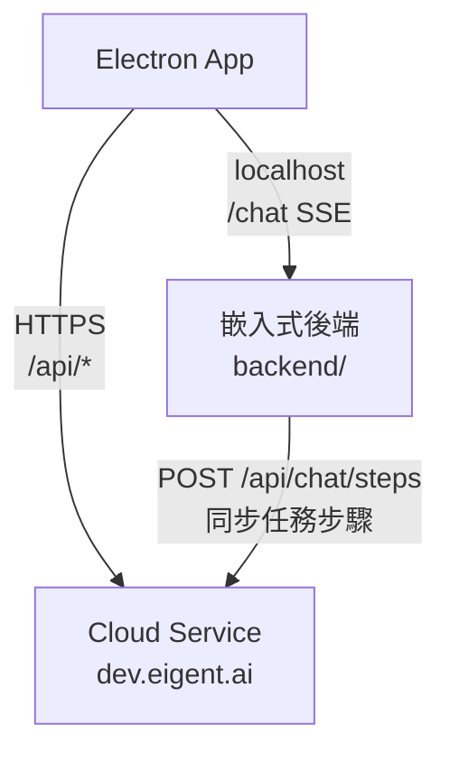
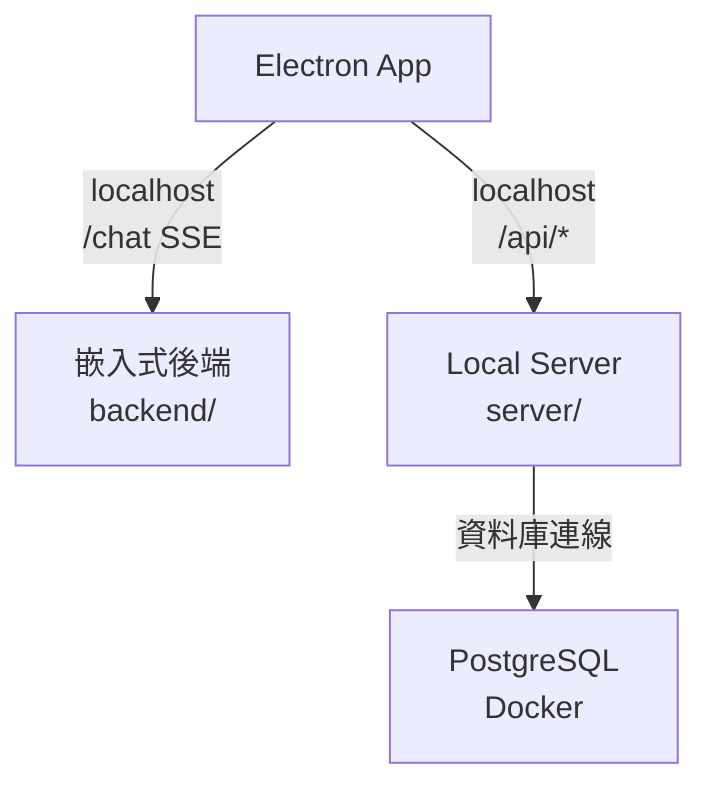
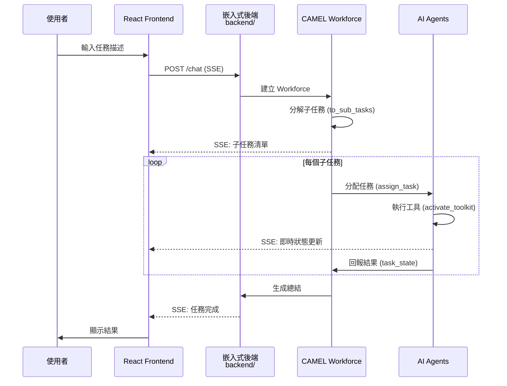

# Eigent 專案架構總覽

> 本文件提供 Eigent 專案的整體架構概述，協助開發者快速理解系統組成與資料流向。

## 專案簡介

**Eigent** 是一款開源的多智能體協作桌面應用程式，基於 [CAMEL-AI](https://github.com/camel-ai/camel) 框架構建。它能將複雜的工作流程自動化，透過多個 AI Agent 並行協作完成任務。

---

## 技術堆疊

| 層級 | 技術選型 |
|-----|---------|
| **桌面框架** | Electron 33.x |
| **前端框架** | React 18 + TypeScript |
| **建置工具** | Vite 5.x |
| **狀態管理** | Zustand |
| **UI 元件** | Radix UI + Tailwind CSS |
| **動畫** | Framer Motion + GSAP |
| **後端框架** | FastAPI (Python 3.12) |
| **多智能體** | CAMEL-AI 0.2.83 |
| **資料庫** | PostgreSQL (本地部署) |
| **即時通訊** | Server-Sent Events (SSE) |

---

## 三層架構圖

```
┌─────────────────────────────────────────────────────────────────────┐
│                        Electron Main Process                        │
│  ┌─────────────┐  ┌──────────────┐  ┌─────────────┐  ┌───────────┐  │
│  │ IPC Handler │  │ WebViewMgr   │  │ FileReader  │  │ Updater   │  │
│  └─────────────┘  └──────────────┘  └─────────────┘  └───────────┘  │
│         │                │                │                │        │
│         └────────────────┴────────────────┴────────────────┘        │
│                                 │                                    │
│                         Preload Script                               │
│                    (contextBridge → ipcRenderer)                     │
└─────────────────────────────────────────────────────────────────────┘
                                  │
                                  ▼
┌─────────────────────────────────────────────────────────────────────┐
│                     Electron Renderer Process                        │
│  ┌──────────────────────────────────────────────────────────────┐   │
│  │                      React Application                        │   │
│  │  ┌──────────┐  ┌──────────┐  ┌──────────┐  ┌──────────────┐  │   │
│  │  │ Pages    │  │Components│  │ Stores   │  │ API Layer    │  │   │
│  │  │ (Home,   │  │ (ChatBox,│  │ (Zustand)│  │ (http.ts)    │  │   │
│  │  │ Login...)│  │ WorkFlow)│  │          │  │              │  │   │
│  │  └──────────┘  └──────────┘  └──────────┘  └──────────────┘  │   │
│  └──────────────────────────────────────────────────────────────┘   │
└─────────────────────────────────────────────────────────────────────┘
                                  │
                          HTTP / SSE
                                  ▼
┌─────────────────────────────────────────────────────────────────────┐
│                       Python Backend (FastAPI)                       │
│  ┌──────────────────────────────────────────────────────────────┐   │
│  │                         Controllers                           │   │
│  │  ┌──────────┐  ┌──────────┐  ┌──────────┐  ┌──────────────┐  │   │
│  │  │ Chat     │  │ Task     │  │ Model    │  │ Tool         │  │   │
│  │  └──────────┘  └──────────┘  └──────────┘  └──────────────┘  │   │
│  └──────────────────────────────────────────────────────────────┘   │
│  ┌──────────────────────────────────────────────────────────────┐   │
│  │                         Services                              │   │
│  │  ┌──────────────────┐  ┌──────────────────────────────────┐  │   │
│  │  │ chat_service.py  │  │ task.py (TaskLock 狀態管理)      │  │   │
│  │  │ (step_solve 核心)│  │                                  │  │   │
│  │  └──────────────────┘  └──────────────────────────────────┘  │   │
│  └──────────────────────────────────────────────────────────────┘   │
│  ┌──────────────────────────────────────────────────────────────┐   │
│  │                      CAMEL Workforce                          │   │
│  │  ┌──────────┐  ┌──────────┐  ┌──────────┐  ┌──────────────┐  │   │
│  │  │Developer │  │ Browser  │  │ Document │  │ Multi-Modal  │  │   │
│  │  │  Agent   │  │  Agent   │  │  Agent   │  │    Agent     │  │   │
│  │  └──────────┘  └──────────┘  └──────────┘  └──────────────┘  │   │
│  └──────────────────────────────────────────────────────────────┘   │
└─────────────────────────────────────────────────────────────────────┘
```

---

## 目錄結構

```
eigent-260119/
├── electron/                 # Electron 主程序
│   ├── main/                 # Main Process (IPC, 視窗管理, 原生功能)
│   │   ├── index.ts          # 主入口
│   │   ├── webview.ts        # WebView 管理器
│   │   ├── fileReader.ts     # 檔案讀取與解析
│   │   ├── init.ts           # 後端啟動邏輯
│   │   └── update.ts         # 自動更新
│   └── preload/              # Preload Script (橋接 Main/Renderer)
│       └── index.ts
│
├── src/                      # React 前端應用
│   ├── pages/                # 頁面元件
│   │   ├── Home.tsx          # 主工作區
│   │   ├── Login.tsx         # 登入頁
│   │   ├── SignUp.tsx        # 註冊頁
│   │   └── History.tsx       # 歷史紀錄
│   ├── components/           # UI 元件
│   │   ├── ChatBox/          # 聊天互動區
│   │   ├── WorkFlow/         # React Flow 工作流程圖
│   │   └── ui/               # 基礎 UI 元件 (Radix-based)
│   ├── store/                # Zustand 狀態管理
│   │   ├── authStore.ts      # 認證狀態
│   │   ├── chatStore.ts      # 任務/訊息狀態
│   │   └── projectStore.ts   # 專案狀態
│   ├── api/                  # HTTP 請求封裝
│   │   └── http.ts
│   └── lib/                  # 工具函式
│
├── backend/                  # Python 後端 (嵌入式, 隨 Electron 啟動)
│   ├── app/
│   │   ├── controller/       # API 路由控制器
│   │   ├── service/          # 業務邏輯 (chat_service, task)
│   │   ├── model/            # Pydantic 資料模型
│   │   └── utils/            # 工具類 (agent, workforce, toolkit)
│   │       └── toolkit/      # MCP 工具封裝
│   └── main.py               # FastAPI 入口
│
├── server/                   # 本地部署後端 (Docker, 含資料庫)
│   ├── app/
│   │   ├── controller/       # 完整 API (含用戶管理)
│   │   └── model/            # SQLModel 資料庫模型
│   ├── docker-compose.yml
│   └── main.py
│
└── docs/                     # 專案文件
```

---

## 部署模式

### 1. Cloud-Connected (雲端連線)



- **用途**：快速體驗，無需設定資料庫
- **認證**：使用 Eigent Cloud 帳號（OAuth 或 Email + 密碼）
- **環境變數**：`VITE_USE_LOCAL_PROXY=false`、`VITE_PROXY_URL=https://dev.eigent.ai`
- **資料流向**：
  - 前端 `/api/*` 請求 → Cloud Service（帳號、設定、資料管理）
  - 前端 `/chat` SSE → 嵌入式後端（任務執行）
  - 嵌入式後端 → Cloud Service（任務步驟同步，需設定 `SERVER_URL`）

### 2. Local Deployment (本地部署)



- **用途**：完全離線、資料隱私
- **認證**：本地註冊帳號（Email + 密碼）
- **環境變數**：`VITE_USE_LOCAL_PROXY=true`、`VITE_PROXY_URL=http://localhost:3001`
- **資料流向**：
  - 前端 `/api/*` 請求 → Local Server（帳號、設定、資料管理）
  - 前端 `/chat` SSE → 嵌入式後端（任務執行）
  - Local Server → PostgreSQL（資料持久化）
  - 嵌入式後端不會同步步驟到雲端（`SERVER_URL` 未設定）

---

## 兩種模式差異對照

| 項目 | Cloud-Connected | Local Deployment |
|-----|----------------|------------------|
| **前端 API 目標** | Cloud Service (`https://dev.eigent.ai`) | Local Server (`http://localhost:3001`) |
| **嵌入式後端** | ✅ 自動啟動（本機執行任務） | ✅ 自動啟動（本機執行任務） |
| **Local Server** | ❌ 不需要 | ✅ 需要啟動（Docker 或 Source Code） |
| **資料儲存** | 雲端（除非另行設定） | 本地 PostgreSQL |
| **帳號註冊** | Eigent Cloud 註冊 | 本地註冊（`POST /api/register`） |
| **OAuth 登入** | ✅ 支援（Google、GitHub） | ❌ 不支援 |
| **任務步驟同步** | ✅ 同步到 Cloud Service（需設定 `SERVER_URL`） | ❌ 不同步（`SERVER_URL` 未設定） |
| **搜尋代理** | ✅ 可使用雲端代理 | ✅ 需配置 API key 或使用本地代理 |

---

## 核心資料流

### 任務執行流程



**注意**：任務執行流程中的「Python Backend」指的是 `backend/`（嵌入式後端），由 Electron 自動啟動。

---

## 相關文件

- [前端架構](./FRONTEND.md)
- [嵌入式後端 API](./BACKEND_API.md)
- [Local Server 和 Cloud Service API](./SERVER_API.md)
- [Electron IPC 通道](./ELECTRON_IPC.md)
- [開發指令速查](./COMMANDS.md)
- [資料模型](./DATA_MODELS.md)
- [術語表](./GLOSSARY.md)
- [開發環境設置](./GETTING_STARTED.md)
- [常見問題 FAQ](./FAQ.md)
